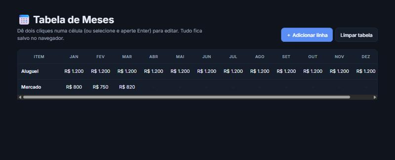

# 📅 Tabela de Meses Editável

Tabela com os 12 meses do ano em que dá para **adicionar, editar e remover linhas** direto no navegador, com os dados **salvos automaticamente**. Feita com HTML, CSS e JavaScript puro.

<p align="center">
  
</p>

## ✨ Funcionalidades

- ➕ Adicionar linhas, já abrindo a edição do nome do item
- ✏️ Editar qualquer célula com dois cliques, ou selecionando com `Tab` e apertando `Enter`
- ⏎ `Enter` salva a edição e `Esc` cancela
- 🗑️ Remover uma linha ou limpar a tabela inteira
- 💾 Dados salvos no `localStorage`: continuam lá quando a página é recarregada
- 🌙 Tema claro e escuro, seguindo o sistema
- 📱 Rolagem lateral no celular, com o cabeçalho dos meses fixo

## 🧠 Decisões técnicas

- **Delegação de eventos:** um único listener no `<tbody>` cuida de todas as células, inclusive as linhas criadas depois. Não é preciso registrar um evento por célula.
- **Estado salvo a cada mudança:** a tabela é lida do DOM e gravada como JSON. Se o `localStorage` estiver bloqueado ou com dados corrompidos, a página continua funcionando com uma tabela em branco.
- **Acessibilidade:** a primeira coluna usa `<th scope="row">`, as células podem ser focadas pelo teclado e os botões têm descrição para leitores de tela.

## 🛠️ Tecnologias

HTML · CSS (variáveis, `prefers-color-scheme`) · JavaScript (DOM, eventos, `localStorage`)

## 📁 Estrutura

```
index.html   → estrutura da página e da tabela
style.css    → visual, tema claro/escuro e responsividade
script.js    → criação das linhas, edição e salvamento
```

## 🚀 Como executar

Baixe o repositório e abra o `index.html` no navegador.
